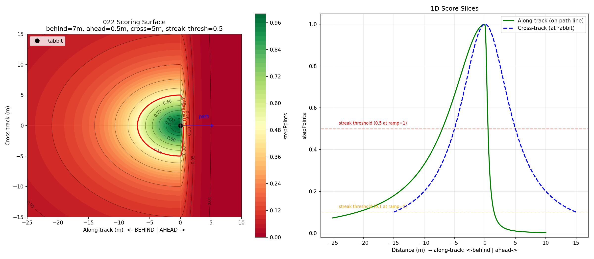

# 022 — Point-Accumulation Fitness with Streak Bonus

**Status**: Draft
**Priority**: P1 — next training cycle improvement
**Created**: 2026-04-01
**Updated**: 2026-04-04

## Problem

The current fitness function has two critical flaws:

1. **Crash penalty cliff**: a discrete jump in fitness when the aircraft crashes,
   giving no gradient for evolution to climb. This required the variation ramp
   (curriculum learning) as a workaround.
2. **Distance target offset**: DISTANCE_TARGET=1.0m creates an artificial
   "orbit at 1m" objective rather than rewarding being on the path.

## Clarifications

### Session 2026-04-05

- Q: Should V1 use sum or lexicase for aggregating per-scenario scores? → A: Lexicase (unchanged from current). Single dimension per scenario: negated score. Completion fraction removed as a dimension — it's already encoded in the score (more steps = more points). Mean throttle deferred as a future second dimension.
- Q: Should attitude delta penalty be kept alongside point accumulation? → A: Drop for V1. Smoothness signals (total energy, bang-bang penalty) likely added as separate objectives later.
- Q: Should intercept budget/scale mechanism be kept? → A: Remove entirely. Scoring surface natural gradient is sufficient; intercept budget was compensating for crash penalty cliff.
- Q: How to handle tangent at final path waypoint? → A: Reuse previous segment tangent. Verify when path actually ends and control returns to operator — scoring should stop at that boundary.
- Q: Should variation ramp be kept with the new fitness function? → A: Keep as-is. Curriculum learning helps convergence independently of fitness shape. Already configurable via VariationRampStep in autoc.ini.

## Solution: Point Accumulation with Streak Multiplier

Inspired by video game scoring. Every timestep earns points. More points = better.
No crash penalty — crash just stops earning points.

### Core Rules

1. **Each step earns points** based on a smooth 3D scoring surface centered on
   the rabbit, oriented along the path tangent. Score = 1.0 at the rabbit,
   decays in all directions — but decays faster ahead than behind.
2. **Streak multiplier**: consecutive steps above a score threshold build an
   escalating bonus (up to 5x). Resets to 1x when score drops too low.
3. **Crash/OOB = stop**. No penalty. The sim ends and the aircraft earns no
   more points. A crash at step 10 just means ~10 steps of points vs ~200+
   for a full flight.
4. **Fitness = total accumulated points**. Higher is better. Variable path
   lengths are handled naturally — longer paths are more opportunity, not
   more penalty.

### Scoring Surface

The rabbit is the origin. The path tangent (rabbit → next waypoint) defines
the reference direction. The aircraft's position relative to the rabbit in
this frame determines the score.

The iso-score surfaces are **ellipsoids** elongated behind the rabbit along
the path tangent. Ahead of the rabbit the ellipsoid is compressed — being
ahead is penalized harder than being behind. The surface is smooth, continuous,
and positive everywhere in 3D space.

```
// Rabbit-centered, path-aligned coordinate frame
offset = aircraft - rabbit
tangent = normalize(path[i+1] - path[i])    // rabbit's direction of travel
along = dot(offset, tangent)                 // + = ahead, - = behind
lateral = offset - along * tangent           // perpendicular component (3D)
lateral_dist = length(lateral)

// Effective distance: directional scaling in path frame
// Behind the rabbit: gentle decay (large scale = forgiving)
// Ahead of the rabbit: steep decay (small scale = punishing)
if along <= 0:
    eff_along = along / behind_scale
else:
    eff_along = along / ahead_scale

eff_lateral = lateral_dist / cross_scale

// Single smooth score: computeStepScore(along, lateralDist) → stepPoints
eff_dist_sq = eff_along^2 + eff_lateral^2
stepPoints = 1.0 / (1.0 + eff_dist_sq)

// Streak: builds when scoring well, hard reset when not
// streak_steps_to_max derived from config: FitStreakRampSec / (SIM_TIME_STEP_MSEC / 1000)
if stepPoints >= streak_threshold:
    streak_count = min(streak_count + 1, streak_steps_to_max)
else:
    streak_count = 0

// Multiplier: 1x base, linear ramp to streak_multiplier_max
// streak_count / streak_steps_to_max gives 0..1 normalized ramp
multiplier = 1.0 + (streak_multiplier_max - 1.0) * streak_count / streak_steps_to_max

// applyStreak(stepPoints) → returns stepPoints * multiplier
score += stepPoints * multiplier
```

### Parameters

All parameters are tunable via autoc.ini:

| Parameter | ini key | Description | Starting value |
|-----------|---------|-------------|---------------|
| behind_scale | FitBehindScale | Along-track scale when behind rabbit | 10.0m |
| ahead_scale | FitAheadScale | Along-track scale when ahead of rabbit | 0.5m |
| cross_scale | FitCrossScale | Lateral/vertical scale | 5.0m |
| streak_threshold | FitStreakThreshold | Min step_points to maintain streak | 0.5 |
| streak_ramp_sec | FitStreakRampSec | Seconds to reach max multiplier | 2.5 |
| streak_multiplier_max | FitStreakMultiplierMax | Maximum multiplier (1x base + Nx bonus) | 5.0 |

**Teardrop shape**: the scoring surface is a teardrop — forgiving behind,
a wall ahead. Being 0.5m ahead scores the same as 10m behind (~0.5).
The gradient strongly discourages overshooting.


*Generated with behind_scale=10.0, ahead_scale=0.5, cross_scale=5.0,
streak_threshold=0.50. Left: top-down contour (rabbit at origin, path
tangent right). Right: 1D slices along-track and cross-track.*

**Score examples** (at rabbit altitude, on path line):

| Position | along | lateral | step_points |
|----------|-------|---------|-------------|
| At rabbit | 0 | 0 | 1.00 |
| 3m behind | -3 | 0 | 0.92 |
| 5m behind | -5 | 0 | 0.80 |
| 10m behind | -10 | 0 | 0.50 |
| 20m behind | -20 | 0 | 0.20 |
| 0.5m ahead | +0.5 | 0 | 0.50 |
| 1m ahead | +1 | 0 | 0.20 |
| 2m ahead | +2 | 0 | 0.06 |
| 5m lateral | 0 | 5 | 0.50 |
| 10m lateral | 0 | 10 | 0.20 |

**Score of 1.0**: at the rabbit position. This is the optimum.

**Signal everywhere**: even at 50m the score is ~0.01. The gradient
always points toward the rabbit, giving evolution something to select
on during the intercept phase.

**Multiplier ramp**: caps at 5x, reaches max in FitStreakRampSec (2.5s).
Rate-independent — streak_steps_to_max is derived from ramp duration and
SIM_TIME_STEP_MSEC at startup. Fast enough to reward short bursts of
good tracking.

### Why This Works

- **No crash cliff**: an aircraft that tracks well for 50 steps then crashes
  keeps its 50 steps of points (with high multiplier). It scores better than
  one that survives 200 steps but wanders at 20m distance the whole time.
- **Streak rewards sustained tracking**: a brief 2m flyby earns a few good
  points at 1x. 25 consecutive steps at 2m earns at up to 5x. The sustained
  tracker wins overwhelmingly.
- **Smooth gradient everywhere**: no discrete jumps. Every meter closer earns
  more points. Every additional on-track step is worth more than the last.
- **Directional bias built in**: the ellipsoidal surface naturally teaches
  "approach from behind" without explicit phase logic.
- **Variable paths handled**: longer paths = more steps = more opportunity.
  No normalization needed.

### Fitness Direction

Current fitness is minimize (lower = better). This is maximize (higher = better).
Negate so existing minimize-based selection works unchanged:

```
fitness = -total_accumulated_points
```

No magic offset constant — just sign flip. Selection operators already
handle negative numbers correctly.

### Diagnostics

Per-scenario logging (in the existing per-scenario summary line):

- **score**: accumulated points for the scenario
- **maxStreak**: longest consecutive streak in the scenario
- **streakSteps**: total steps spent in streak (stepPoints >= threshold)
- **maxMult**: highest multiplier reached

Per-generation logging (in `data.stc` or console):

- **bestScore**: best individual's total score across all scenarios
- **avgMaxStreak**: mean of max streak length across scenarios for best individual
- **pctInStreak**: % of total steps spent in streak for best individual

These let us track whether the NN is learning to sustain tracking (streak
length growing) vs just getting closer on average (avgStepPts growing).
Both should improve, but streak length is the key indicator of sustained
control.

## Implementation Notes

- Replaces `computeStepPenalty()` in `fitness_computer.h`
- Replaces distance/attitude accumulation in `autoc.cc` (lines ~596-648)
- Removes: DISTANCE_TARGET, DISTANCE_NORM, DISTANCE_POWER, ATTITUDE_NORM,
  ATTITUDE_POWER, CRASH_COMPLETION_WEIGHT, intercept budget/scale
- Path tangent: `normalize(path[i+1].start - path[i].start)` — already available
- `dot(offset, tangent)` for along-track decomposition
- Streak counter: per-scenario state, reset at flight start
- Per-scenario score: accumulated points for that scenario
- Lexicase selection: one dimension per scenario = `-score` (lower is better)
- Completion fraction, attitude, throttle removed as separate lexicase dimensions
- Total fitness for logging = sum of `-score` across scenarios

## V1: Symmetric Cross-Track (This Iteration)

Lateral/vertical treated identically via cross_scale. The ellipsoid is
axially symmetric around the path tangent — a "cigar" shape elongated
behind the rabbit.

## V2: Asymmetric Cross-Track (Future)

Split cross_scale into directional components relative to gravity and
turn direction:

- **Below penalty**: below the rabbit decays faster than above.
  Being below is dangerous (terrain, energy deficit). Above is safer.
- **Outside-turn penalty**: outside the turn decays faster than inside.
  Cutting inside is tighter tracking; drifting outside is losing it.

The ellipsoid becomes a general 3D shape — still smooth, still a single
`eff_dist_sq` computation, just with different scales per quadrant.

```
// V2 additions:
up = -gravity_dir                            // [0,0,-1] in NED = up
turn_inside = cross(tangent, up)             // points toward turn center

vert_component = dot(lateral, up)
horiz_component = dot(lateral, turn_inside)

if vert_component >= 0:
    eff_vert = vert_component / above_scale    // generous
else:
    eff_vert = vert_component / below_scale    // harsh

// similar for inside/outside turn...
```

### V2 Additional Inputs Required

V2 needs two things the NN doesn't currently have:

1. **Gravity vector estimate (attitude-independent)**. The fitness function
   needs "which way is down" regardless of aircraft attitude. In sim this is
   trivial ([0,0,1] in NED). On real hardware the NN would need a gravity
   estimate in the earth frame — derivable from the quaternion (rotate body-Z
   to earth frame), but the fitness function runs post-flight so it has the
   full state. Not an NN input issue, just a fitness computation detail.

2. **Path curvature / turn direction at the rabbit**. The single tangent
   vector isn't enough — we need the path shape around the rabbit to know
   which side is "inside the turn." This requires the path deltas before
   and after the current rabbit position:
   - `tangent_prev = normalize(path[i] - path[i-1])` — where rabbit came from
   - `tangent_next = normalize(path[i+1] - path[i])` — where rabbit is going
   - `curvature = tangent_next - tangent_prev` — points toward turn center
   - `turn_inside = normalize(curvature)` — inside-turn direction

   On straight segments curvature ≈ 0 and there's no inside/outside
   distinction (cross_scale stays symmetric). On turns the curvature
   vector naturally defines the preferred side.

   For real-time NN inputs (future): the path prediction could come from
   a nav estimator that provides not just current rabbit position but
   upcoming waypoint deltas — giving the NN foresight into turns.

## Other Future Additions

- Multi-point leading (score against future rabbit positions for turn anticipation)
- Heading alignment bonus (body heading vs path tangent)
- Adaptive scales based on path curvature magnitude or rabbit speed

Start simple, add complexity only if needed.

## Observations from test1 Training Run (2026-04-05)

### Entry Position Offset Required
Without entry position offset (EntryPositionRadiusSigma=0), the NN exploits
starting near the rabbit — it dives at the rabbit, scores 8-10 high-multiplier
steps, then crashes. Score: ~13 per scenario. This dominated the "fly far away
and survive" strategy (~3 per scenario). Fixed by enabling
EntryPositionRadiusSigma=15, which ramps with variation scale.

### Plateau at ~-3600 Best Fitness (gen 130-207)
The best individual found tracking on ~5-10 favorable scenarios (20+ step
streaks, scores 50-58, multiplier 4-5x) but scores poorly on the remaining
~235 scenarios (score 1-17, no streaks). The total is dominated by the
low-scoring majority. The NN can't generalize its tracking behavior across
varied entry conditions.

### Streak Threshold Ramp (Proposed)
The streak threshold (0.5) demands stepPoints >= 0.5 (~10m behind or ~5m
lateral). Early in training when the population is far from the rabbit,
almost no individual achieves this — there's no multiplier signal to
differentiate "getting closer" from "still far." A ramped threshold would:
- Start low (e.g., 0.1 = ~22m) so early generations can discover that
  approaching the rabbit triggers multiplier bonus
- Ramp to 0.5 over training, progressively demanding tighter tracking
- Could use the same VariationRampStep mechanism or a separate ramp
- Config: `FitStreakThresholdMin=0.1` + `FitStreakThresholdMax=0.5`,
  interpolated by computeVariationScale()

### Lexicase Single-Dimension Limitation
With only `-score` as the lexicase dimension, there's limited pressure to
improve on the many low-scoring scenarios. An individual that scores 50 on
3 scenarios and 5 on 242 scenarios has similar total fitness to one that
scores 10 on all 245. Lexicase should differentiate per-scenario, but with
score ranging from 1-58 and epsilon at ~5%, most individuals look similar
on any given low-scoring scenario. A future second dimension (e.g., steps
survived, or mean stepPoints) might help lexicase discriminate.
