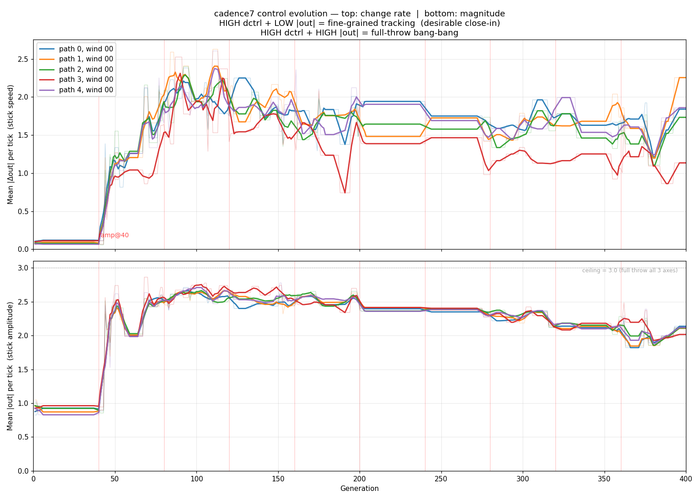

# cadence7: control aggressiveness + magnitude evolution across generations

**Date**: 2026-04-21
**Source**: `/home/gmcnutt/autoc/data.dat` (full cadence7 training log, 7.4 GB,
16.9 M rows, 400 gens × 245 scenarios).
**Slice**: paths 0–4 at wind 00 — 5 lines per panel.

Two metrics per (gen, path, wind) trajectory:

- **dCtrl** (top panel) = mean over consecutive ticks of
  `|ΔoutPt| + |ΔoutRl| + |ΔoutTh|`. "Stick speed" — how fast the command
  changes per 100 ms NN tick.
- **|out|** (bottom panel) = mean over ticks of
  `|outPt| + |outRl| + |outTh|`. "Stick amplitude" — how hard the command
  pushes, independent of how fast it moves. Ceiling is 3.0 (full throw on
  all three axes simultaneously).

Averaging by step count normalizes shorter (crash-truncated) early-gen
trajectories against longer late-gen flights.



## Reading the pair

The two panels jointly classify the control regime:

| dCtrl | \|out\| | Regime |
|---|---|---|
| HIGH | HIGH | **Full-throw bang-bang** — saturating often, stick chattering between extremes |
| HIGH | LOW  | **Fine-grained tracking** — rapid small corrections around a quiet setpoint |
| LOW  | HIGH | Sustained deflection — banked turn, climb, held-trim |
| LOW  | LOW  | Quiet stick — cruise, no input needed, or dead controller |

Neither panel alone can distinguish the first two regimes. For flight behavior
and energy cost, the distinction matters.

## Shape of the cadence7 curves

### dCtrl (top — stick speed)

Three regimes:

1. **Pre-ramp (gens 1–40)**: flat at ~0.1. `computeVariationScale` returns 0
   before `VariationRampStep=40`, so there's no wind/entry variation to
   punish a quiet controller. Evolution converges on "do nothing" as a local
   optimum.

2. **Ramp-on (gens 40–90)**: sharp step to ~1.0 at gen 40, rapid growth to
   2.0–2.5 peak. Environmental variation is suddenly scored, and the NN
   finds that high-amplitude outputs pass lexicase cases low-amplitude ones
   fail.

3. **Settled (gens 90–400)**: oscillates in the 1.5–2.0 band, with path 3
   around 1.2. No monotone rise — the ceiling is set by "max-throw crashes
   on some variants", not by search. **Slow downward trend** visible — peak
   near gen 60–90 of ~2.3 settles to ~1.5–1.7 by gen 400 (≈30% reduction
   across the remaining 300 gens). Already a small selection signal for
   smoother control, likely from lexicase picking off the worst
   bang-bang offenders on rare variant cases. Not enough to reach fine-
   grained tracking, but non-zero — and worth noting: the pressure exists
   within the current fitness setup, it's just weak.

### |out| (bottom — stick amplitude)

- Pre-ramp: ~0.1 (flat, no control at all).
- Ramp step (gen 40): jumps to ~2.6.
- Gens 40–150: decays from ~2.6 toward ~2.2 steady-state.
- Gens 150–400: all paths converge on |out| ≈ **2.15–2.22**.

**Ceiling is 3.0**, so mean 2.2 means each axis averages ~0.73 absolute.
Outputs are at ~73% saturation throughout late training.

## Joint reading: cadence7 is full-throw bang-bang, not fine dither

Both panels are HIGH in the settled regime (dCtrl ~1.5, |out| ~2.2).
That's regime 1: **saturating-and-flipping**, not regime 2 (fine-grained
tracking). The NN has not learned to use small-amplitude corrections;
it saturates axes frequently.

Per-path summary:

| Path | Mean dCtrl | Mean \|out\| | Reading |
|---|---|---|---|
| 0 | 1.57 | 2.18 | Bang-bang, typical |
| 1 | 1.54 | 2.18 | Bang-bang, typical |
| 2 | 1.47 | 2.20 | Bang-bang, typical |
| 3 | **1.22** | **2.22** | **Holding policy** — lower stick speed, slightly higher amplitude. More sustained-deflection than chatter. |
| 4 | 1.52 | 2.19 | Bang-bang, typical |

Path 3's lower dCtrl with slightly higher |out| suggests a quieter,
holding-style policy for that path's geometry. The rest of the paths use
the same saturate-and-flip strategy with small variations in how often.

## Reading vs the fitness curve

Cross-reference with [`autoc-024-cadence7-fitness.png`](./autoc-024-cadence7-fitness.png):

- Fitness was flat at ~-2584 through gen 40 (same plateau as dCtrl=0.1).
  **Neither metric moves until the ramp unlocks the landscape.**
- Post-ramp fitness descent (gens 41–400) accompanies the dCtrl plateau at
  1.5–2.0, not a dCtrl rise. This tells us cadence7's ongoing improvement
  is in **decision quality** (where and when to deflect), not in **decision
  aggressiveness** (how hard).
- The gen-40 discontinuity in both plots is the variation ramp, not a
  convention bug or sim instability. Interpret any 024/025 run that
  *doesn't* show this jump as a possible signal that variations are mis-
  scaling.

## Pre-flight implication

The converged policy uses controls at mean |out| ≈ 2.2 / 3.0 (73%
saturation across three axes) with mean |Δout| ≈ 1.5 per 100 ms tick
(each axis ~0.5 per tick average change). That's aggressive,
high-amplitude, high-chatter — full-throw bang-bang, not fine dither.
Expect the flight FC to see fast, near-full-deflection RC commands.
INAV's rate PID must be capable of tracking these without saturating or
slewing behind; bench T114 should include a motor-off servo-rate sanity
check that full-throw commands land on the surfaces in under one 100 ms
eval tick.

## Note for 025: bang-bang may be a symptom of insufficient variation

cadence7's full-throw bang-bang policy is what falls out of the current
training when the only thing selection sees is tracking error on a
fixed-geometry airframe with fixed servo dynamics. Under those
constraints, saturation is cheap — there's no penalty that distinguishes
"commanded full-throw because I'm late" from "commanded full-throw
because I always do." The NN has no reason to discover finer-grained
control.

**"Pressure for smoother control" approaches tried historically**:

- **Induced drag / energy modeling** — tried in early runs; didn't
  converge on a useful signal.
- **Control-smoothness penalty term** — explicit in early fitness
  variants; interacted badly with tracking-error term, no clean win.
- **Work-to-track estimation** — futile without modeling wind, which is
  itself dynamic and disturbance-dominated. Can't separate "work the
  controller did unnecessarily" from "work the wind forced on it."

**And the project constraint**: autoc fitness doesn't use tunable
coefficients. Any explicit penalty term (`|Δout|²`, `|out|²`, or energy)
would need a weight relative to the point-accumulation fitness, which
we don't add.

**025's path may already do this implicitly**: 025 is scoped around
adding variation across
- aerodynamic coefficients (airframe-to-airframe),
- servo dynamics (slew rate, deadband, backlash),
- power (throttle-to-thrust, battery sag),
- CG,
- and more.

A bang-bang policy is brittle against those variations: a hair-trigger
full-throw command that works on the nominal airframe will overshoot on
a CG-forward variant, saturate a slow servo, or stall a weaker motor.
Evolution against a population of airframe variants should select
against "only works at nominal" strategies — and in doing so, may
naturally push toward smoother, more robust control without any
explicit smoothness pressure in fitness.

**The signal already exists, weakly, in cadence7.** The 2.3 → 1.5
drift in dCtrl over gens 90–400 (see above) says the current setup
*does* reward smoother control — the selection pressure is just thin
because the airframe+servo are fixed. 025's variations amplify what's
already a real signal rather than inventing a new one.

If 025 adds the variation but bang-bang persists, that's a stronger
signal that an explicit structural change in selection (e.g. Pareto
multi-objective on tracking + some robustness proxy) is needed. But
it's worth seeing what variation alone does first.

**Visualization infrastructure kept**: [`plot_control_aggressiveness.py`](./plot_control_aggressiveness.py)
works on any training run's data.dat. Rerun after cadence-025 (or
whatever 025's first full training is called) and compare the dCtrl /
|out| plateau values. If dCtrl drops meaningfully with |out| holding or
rising, variation selected for hold-based control. If |out| drops with
dCtrl held, it selected for quieter stick. Either would be movement
off the current regime.

## Reproducibility

```
# 1. Prefilter training data to 5 starter paths (wind 00):
awk 'NR==1 || /^[0-9]+ [0-9]+ 00[01234]\/00:/' /home/gmcnutt/autoc/data.dat \
    > /tmp/cadence7_starter_paths.dat

# 2. Render:
python3 specs/024-sim-real-fidelity/plot_control_aggressiveness.py
```

Script: [`plot_control_aggressiveness.py`](./plot_control_aggressiveness.py).
Reusable on any future training run by re-pointing at its data.dat (pass as
first argument).
