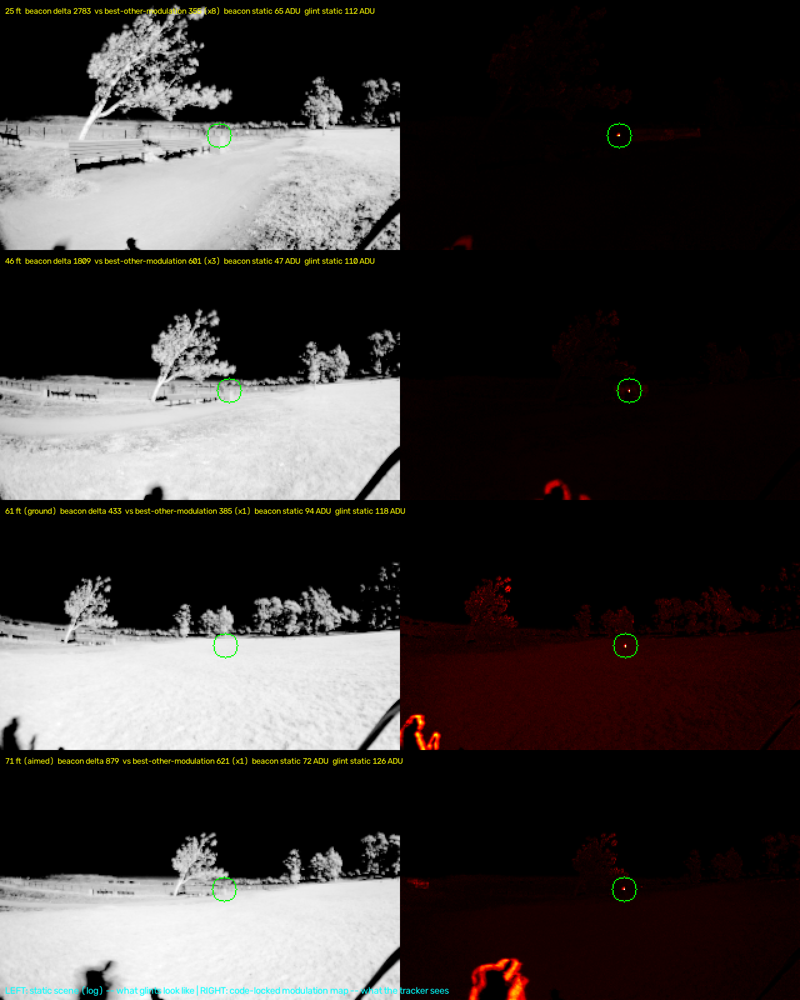

# Field session 1 — the outdoor range ladder, on the real optics in real sun (2026-08-30)

First field deployment. Remote operation over tailscale-through-hotspot throughout (operator at the
site, analysis from home over a 209 kB/s DERP relay — the field-ops.md workflow, used in anger and it
held). All clips on `beaconpi5:/data/rng*.bcnr` + `site0/1`; emitter = bench pod, 5 LEDs IN SERIES at
50 mA (15 V string, ~0.75 W peak, ~52 % code duty), exposure pinned 45 µs / gain 1.0, flight optics.

*Left: the static scene (log stretch) — sunlit grass, tree, glints. Right: the code-locked modulation
map over the same 5 s. The beacon (circled) is INVISIBLE on the left at every range — statically dimmer
than the glint field — and is the dominant point on the right until wind clutter catches up.*

## The scene (site0, before the beacon)

Frame mean **34.9 ADU** (indoors: 0.01), ground band p90 81 / p99 99, **685 saturated glint pixels**
with no beacon in frame. The indoor noise cliff does not exist here: events/frame at thr 8 = **1085**
(indoors ~31); thr 20 → 81. Sky through the bandpass: **0.0 ADU — black**.

## The ladder

| rung | config | live lock | beacon Δ (5×5) | inverse-square predicts | static: beacon vs glints |
|---|---|---|---|---|---|
| 25 ft | on can, aimed | **91 %**, q 1.00, first lock 1.8 s | ~320 | — | 65 vs 112 ADU |
| 46 ft | on can | 54 %, intermittent deaths | ~85 | 89 ✓ | 47 vs 110 |
| 61 ft | on ground, sun 120° right | 30 %, q 0.93, ±1.4 px wobble | ~52 | 50 ✓ | 94 vs 118 |
| 71 ft | on can, wedge-aimed | ~1 % (one candidate flicker, q 0.72) | ~60 | 37 | 72 vs 126 |

**The falloff is clean inverse-square** — no atmospheric surprise at these ranges. The operating
threshold at 45 µs against sunlit ground sits at **Δ ≈ 60–85 (5×5)**; 61 ft and 71 ft straddle it, which
is why their lock rates differ so much at similar Δ. Per-5 s Δ blocks are flat within every clip — **no
battery fade inside any rung** (the 150 mAh cell died between stations, not during them).

**The beacon is statically dimmer than the ground glints at every range measured.** Detection by
brightness is impossible outdoors at any wavelength; the code is the only discriminator, and its margin
over wind clutter fell ×8 → ×3 → ×1 across the ladder. Lock dies where modulation stops out-arguing
moving clutter, not where photons stop arriving.

## Findings beyond the ladder

- **Aim dominates before range does.** The 71 ft "no photons" verdict of the first attempt was BEAM AIM —
  a hand sweep produced brief locks as the cone crossed the camera. The series string's cone is narrow;
  the flight cube's all-attitude LED geometry is the fix, and raw current only helps once the cone
  actually intersects the camera.
- **The exposure lever is DEAD against sunlit ground.** At 400/1000 µs the beacon's backdrop sits at
  mean 211/248 with pixels pinned against the rail — lit-chip photons clip and the modulation is
  crushed. (Refinement of the field-time prediction: pinned-and-clipping, not fully railed.) The lever
  only exists against dark backdrops.
- **Outdoor false confirms, mechanism identified.** Two CONFIRMED locks at q 0.55–0.57 during the sweep
  were a PERSON-EDGE crossing bright grass: series p2p ~1100 (broadband), code correlation 0.04–0.06
  (none). A high-contrast moving edge transiently clears q_lock = 0.55 by chance. `q_fix` (0.75) kept
  them out of MEASURED_FIX; the PROMOTION bar is what needs outdoor-clutter awareness. Backlog.
- **Wind foliage is the modulation clutter floor**, exactly as the driveway measurements predicted —
  the ×1 margins at 61/71 ft are beacon-vs-swaying-leaves, plus the walking operator.
- `rng71ft_sweep.bcnr` kept as a natural-clutter fixture (geese in FOV + person motion + sweep).

## Emitter scaling, measured-anchored (operator's numbers: series string, 1 A in LED envelope, 150 mAh cell)

Range ∝ √I on the measured 50 ft @ 50 mA ground-backdrop anchor:

| drive | power peak/avg | ground-backdrop range | 150 mAh runtime (1S+boost ~85 %) |
|---|---|---|---|
| 50 mA | 0.75 / 0.39 W | ~50 ft | ~75 min |
| **300 mA** (flight plan) | 4.5 / 2.3 W | **~120 ft** | **~12 min — a sortie** |
| 1 A | 15 / 7.8 W | ~225 ft | ~3.6 min at ~16C — needs a bigger cell |

A commanded power mode (1 A for acquisition, 300 mA once locked) keeps average draw sortie-friendly.

## Backdrop, corrected by the operator

The first read of this data was "looking up is the mission case, ground backdrop is the corner". The
operator's correction stands as the design position: **this is all-attitude flying — the craft moves
against a moving background, and looking up is the luxury, not the norm.** Ground/foliage backdrop
performance is therefore the primary axis, which:

- raises the value of drive current (the one lever that works against bright ground),
- makes **940 nm worth a real look** (solar water-absorption dip: background ÷2–4, QE ×~½, net ~×1.3
  range where it counts) rather than a footnote,
- and keeps the code-margin-vs-clutter problem (promotion bar, foliage rejection) on the critical path.

## Next (recorded for the following sessions)

1. **M1 improvements** — separate session, sim line (~/autoc).
2. **Build 2× 300 mA emitters** for craft installation.
3. **Moving-field tests**: camera static + craft moving; then craft hung STATIC at various orientations
   from a large quad → a systematic sun/target/craft/background orientation matrix. That fixture
   measures the aim-cone and backdrop axes independently — exactly the two things this session showed
   dominate.
